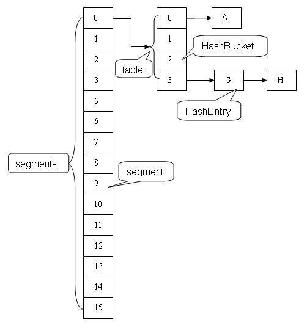
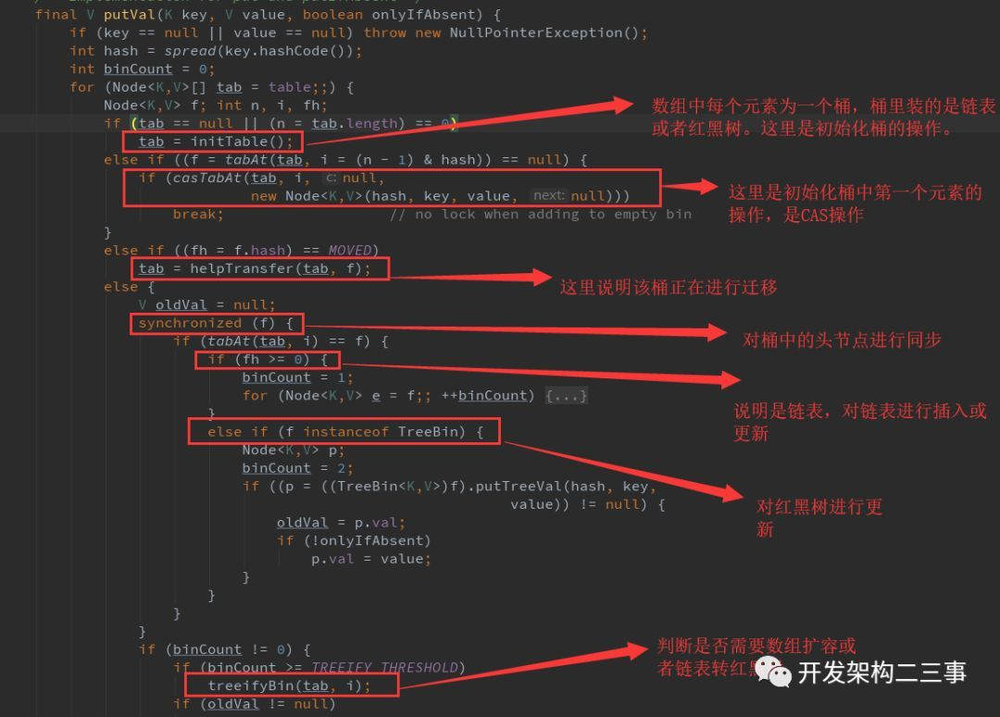

# ConcurrentHashMap
线程安全的HashMap
## JDK1.7
采用分段锁Segment的机制，Segment继承ReentrantLock用来充当锁的角色，每个 Segment 对象守护每个散列映射表的若干个桶。



### 如何将K-V映射到Segment上
根据Key的hash值，做个转换 `int j = (hash >>> segmentShift) & segmentMask`
并根据得到的 `j`找到对应的Segment（如果没有，则创建）
>1. 这里的Ky的hash值算法即不是Object.hashcode()方法，也跟HashMap中ey的hash值算法不同

### Segment的创建
Segment会以this.segments[0]为原型进行创建，创建好后通过CAS操作记录到this.segments中

## JDK1.8


> 对桶中第一个元素使用CAS操作，对后续元素使用synchronized操作（同步对象为桶头元素）
> 扩容叫 `tryPresize()`

### 为什么JDK1.8不用Segment
1. 减少内存开销:如果使用ReentrantLock则需要节点继承AQS(AbstractQueuedSynchronizer)来获得同步支持，增加内存开销，而1.8中只有头节点需要进行同步。
2. 内部优化:synchronized则是JVM直接支持的，JVM能够在运行时作出相应的优化措施：锁粗化、锁消除、锁自旋等等。
3. JDK1.8锁的粒度更小。

### ConcurrentHashMap之put
通过Key找到Segment后，进而调用Segment的put方法。由于Segment继承至ReentrantLock，因此整个put方法全用 `tryLock()` 与 `unlock()` 包裹。
> 这个锁把Segment的扩容（这个扩容叫 `rehash()`，而在HashMap里叫 `resize()`）也包裹了。

### ConcurrentHashMap之get
ConcurrentHashMap的get方法是没有加锁的，通过volitale对table进行修改，保证了可见性：
```
public V get(Object key) {
    Node<K,V>[] tab; Node<K,V> e, p; int n, eh; K ek;
    int h = spread(key.hashCode()); //计算hash
    if ((tab = table) != null && (n = tab.length) > 0 &&
        (e = tabAt(tab, (n - 1) & h)) != null) {//读取首节点的Node元素
        if ((eh = e.hash) == h) { //如果该节点就是首节点就返回
            if ((ek = e.key) == key || (ek != null && key.equals(ek)))
                return e.val;
        }
        //hash值为负值表示正在扩容，这个时候查的是ForwardingNode的find方法来定位到nextTable来
        //eh=-1，说明该节点是一个ForwardingNode，正在迁移，此时调用ForwardingNode的find方法去nextTable里找。
        //eh=-2，说明该节点是一个TreeBin，此时调用TreeBin的find方法遍历红黑树，由于红黑树有可能正在旋转变色，所以find里会有读写锁。
        //eh>=0，说明该节点下挂的是一个链表，直接遍历该链表即可。
        else if (eh < 0)
            return (p = e.find(h, key)) != null ? p.val : null;
        while ((e = e.next) != null) {//既不是首节点也不是ForwardingNode，那就往下遍历
            if (e.hash == h &&
                ((ek = e.key) == key || (ek != null && key.equals(ek))))
                return e.val;
        }
    }
    return null;
}
```
> 感觉上的CAS+读写状态，而不是读写锁