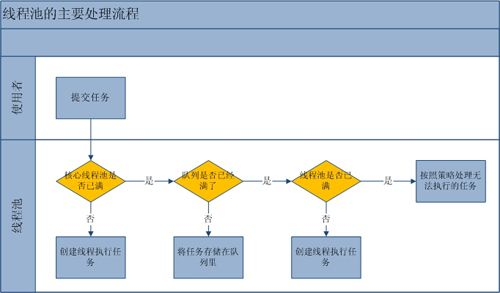

# 线程池
我们常常会新建线程去异常地执行某些任务，但当任务数较多，且执行时间又不是很长的时候，频繁创建线程就会大大降低系统的效率，
因为频繁创建线程和销毁线程需要时间。线程池就是将线程预先创建好旋置于“池”中，需要的时候取，用完归还而不是销毁。
而将需要线程执行的任务用队列缓存起来。

## 优点
- 避免了频繁创建、销毁线程的开销

## 缺点
- 任务太多可能线程池中线程数量激增，增加系统负担
- 任务太多可能导致任务缓存队列过大，增加系统负担
- 适用于生存周期较短的的任务，不适用于又长又大的任务。

## 线程池处理流程

### 处理流程
1. 如果线程池的当前大小还没有达到基本大小(poolSize < corePoolSize)，那么就新增加一个线程处理新提交的任务；
2. 如果当前大小已经达到了基本大小，就将新提交的任务提交到阻塞队列排队，等候处理workQueue.offer(command)；
3. 如果队列容量已达上限，并且当前大小poolSize没有达到maximumPoolSize，那么就新增线程来处理任务；
4. 如果队列已满，并且当前线程数目也已经达到上限，那么意味着线程池的处理能力已经达到了极限，此时需要拒绝新增加的任务。
至于如何拒绝处理新增的任务，取决于线程池的饱和策略RejectedExecutionHandler。

### 设计思考
这里可以看到在线程池中线程数已达到核心线程数时，新任务是优先缓存到队列中，而不是创建新的线程去执行。
因为新建线程的开销是要比缓存到队列更大，新建线程一方面会占用内存，另一方面也会有时间上的开销。

如果是自行设计线程池的话，容易想到的可能就两个组成部分，一个是设置最大容量的线程池，另一个则是缓存任务的队列：当任务来了，
首先看线程池中有没有空闲的线程，如果有，交给它去执行，如果没有，则看当前线程池中的线程数是否达到最大容量，若没有，则新建线程去执行。
若达到了，则利用队列缓存任务（即现有实现中的Executors.newFixedThreadPool(int)）。若这样设计，当系统遇到突发流量时，则会产生任务堆积，
显得较慢。在这种时不时流量突发的情况下，是否可以允许临时多创建几个线程呢？当流量突发过去，多创建的线程慢慢销毁，
线程池又回到了之前设置的线程数量（即现有实现中的Executors.newCachedThreadPool(int)）。

这种线程池的设计思路即将AB问题转化为了B'AB问题，B'和B分别对应这里的核心线程数和最大线程数。那么我们是否可以扩展为A'B'AB的设计呢？
即将队列也设计为两种，一种叫“优先队列”，一种叫“扩展队列”：任务来临时先保存于“优先队列”中，当“优先队列”保存不下时，
交给核心线程去执行，核心线程执行不了交给扩展队列，扩展队列保存不下，则创建新线程处理，新线程创建不了则执行拒绝策略。（纯属乱想）