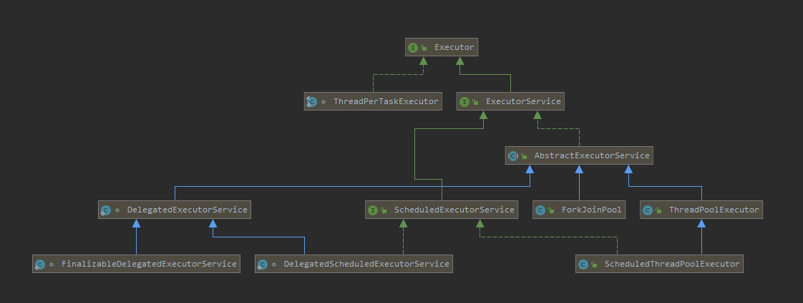

# Executor


## Executor的设计思想
| 概念 | 理解 |
| ---- | ---- |
| Thread | 线程 |
| Runnable | 任务 |
| Executor | 执行者/器 |

`Executor` 作为 JDK 线程最顶级的规范，处于 `java.util.concurrent` 并发包中。

这个规范只规定了一个执行方法： `void execute(Runnable command);` 但是具体如何执行并未规定

比如可以开启一个新线程去执行、可以放置到线程池中去执行，或者采用调用者线程去执行
```java
class ThreadPerTaskExecutor implements Executor {
    public void execute(Runnable r) {
        new Thread(r).start();
    }
}
```

```java
class DirectExecutor implements Executor {
    public void execute(Runnable r) {
        r.run();
    }
}
```

这个接口设计为任务提交与执行的解耦。
> 将 `new Thread(new RunnableTask()).start()` 解耦为： `executor.execute(new RunnableTask())`；即为：将“实现”抽象为“规范”

## 实践：顺序执行的Executor
同样， `Executor` 也未规定多次 `execute` 任务的执行顺序。这里实现一个顺序执行的Executor
```java
public class SerialExecutor implements Executor {
    private final Queue<Runnable> tasks = new ArrayDeque<>();
    private final Executor executor;
    private Runnable active;

    SerialExecutor(Executor executor) {
        this.executor = executor;
    }

    public synchronized void execute(final Runnable r) {
        tasks.offer(() -> {
            try {
                r.run();
            } finally {
                scheduleNext();
            }
        });
        if (active == null) {
            scheduleNext();
        }
    }

    protected synchronized void scheduleNext() {
        if ((active = tasks.poll()) != null) {
            executor.execute(active);
        }
    }
}
```
> 可参照guava的实现： com.google.common.util.concurrent.SerializingExecutor

## 其它相关
| 类 | 说明 |
| ---- | ---- |
| ExecutorService | 扩展规范（在此单一职责规范上添加了更多的规范） |
| ThreadPoolExecutor | 线程池实现 |
| Executors | 为创建Executor提供factory方法 |
