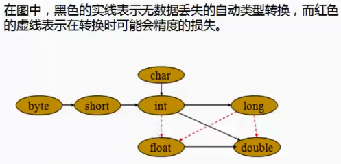

# 数据类型
Java是一种强类型语言，每个变量都必须声明其类型。Java的数据类型分为8种基本数据类型与引用数据类型。

## 8种基本数据类型
| 类型 | 分类 | 占用存储空间 | 表示范围 |
| ---- | ---- | ---- | ---- |
| boolean | 布尔类型 | 取决于JVM | true, false |
| char | 字符型 | 2 bytes | ['\u0000', '\uffff'] 即 [0, 65535] |
| byte | 整数类型 | 1 byte | [-128, 127] |
| short | 整数类型 | 2 bytes | [-32768, 32767] | 
| int | 整数类型 | 4 bytes | [-2^31, 2^31-1]
| long | 整数类型 | 8 bytes | [-2^63, 2^63-1] |
| float | 单精度浮点 | 4 bytes | -- |
| double | 双精度浮点 | 8 bytes | -- |

### 浮点数的精度问题
浮点数是不精确的，不要用于计算。
```java
public class DataTypeTest {
    @Test
    public void testAccuracy() {
        double a = (3.3 - 2.4) / 0.1;
        System.out.println(a); // 8.999999999999998

        float f1 = 0.65f;
        float f2 = 0.6f;
        float f3 = f1 - f2;
        System.out.println(f3); // 0.049999952

        System.out.println(5.9 + 0.2); // 6.1000000000000005
        System.out.println(5.9 + 0.2 == 6.1); //false
    }
}
```
上面的计算在每个计算机上都可能得出不同的结果。

### 自动类型转换
- 可以将整型常量直接赋值给byte, char, short
- 容量小的数据类型可以自动转换为容量大的数据类型



```java
public class DataTypeTest {
    @Test
    public void testAutoChange(){
        byte a = 100; // int -> byte
        int i = a; // byte -> int
    }
}
```
`byte a = 100`中的100为int类型，参见[默认类型](#默认类型)

### 默认类型
默认的整型为int类型，默认的浮点型为double类型。即：`int number = 5`中的5为int类型，`double d = 5.6`中的5.6为double类型
```java
public class DataTypeTest {
    @Test
    public void testDefaultType(){
        int number = 5; //这里的5默认为int类型
        long number1 = 5; //这里的5默认为int类型，且自动转化为long类型（容量小的数据类型可以自动转换为容量大的数据类型）
        long number2 = 21474836470L; //21474836470超出了int类型范围，这里需要使用21474836470L表示为long类型
        System.out.println((int)number2); //强制将long类型的number2转化为int类型（会产生溢出，得不到想要的结果）
        double d = 5.6; //这里的5.6默认double类型，即5.6D。
        float f = 5.6F; //这里的5.6默认double类型，无法自动转换为更小容量的类型float，这里需要使用5.6F表示为float类型
        float f1 = (float) 5.6;//强制将double类型的5.6转化为float类型
    }
}
```
