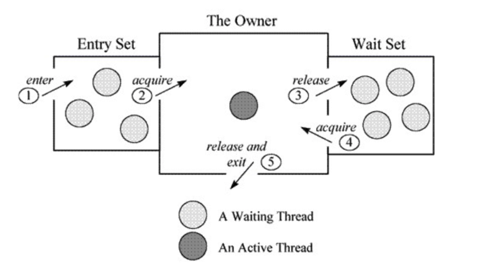

# synchronized与Lock
## synchronized与Lock比较
1. 类型及使用不同
    > Lock是一个接口，而synchronized是Java中的关键字。synchronized是隐式使用，可对代码块、方法使用；Lock为显式使用，只对代码块使用
2. 对异常的处理
    > synchronized在其代码块发生异常时，会自动释放锁；Lock则不然，因此一般在finally释放Lock锁
3. Lock提供更多的特性
    1. lockInterruptibly
    2. tryLock
    3. ReentrantLock提供fair lock
    0. 读写锁（ReadWriteLock其实是另一个顶级接口）
4. 实现原理
    1. synchronized使用JVM来实现
    2. Lock代码层面实现（CAS操作）
5. JDK更钟爱synchronized
    ```
    JDK1.5中，synchronized是性能低效的。因为这是一个重量级操作，它对性能最大的影响是阻塞的是实现，挂起线程和恢复线程的操作都需要
    转入内核态中完成，这些操作给系统的并发性带来了很大的压力。相比之下使用Java提供的Lock对象，性能更高一些。多线程环境下，
    synchronized的吞吐量下降的非常严重，而ReentrankLock则能基本保持在同一个比较稳定的水平上。
    
    到了JDK1.6，发生了变化，对synchronize加入了很多优化措施，有自适应自旋，锁消除，锁粗化，轻量级锁，偏向锁等等。
    导致在JDK1.6上synchronize的性能并不比Lock差。官方也表示，他们也更支持synchronize，在未来的版本中还有优化余地，
    所以还是提倡在synchronized能实现需求的情况下，优先考虑使用synchronized来进行同步。
    ```
## synchronized的优化
### 锁升级
Synchronized的升级顺序是 无锁-->偏向锁-->轻量级锁-->重量级锁，顺内不可逆。
> Java SE 1.6中为了减少获得锁和释放锁带来的 性能消耗而引入的偏向锁和轻量级锁
#### 无锁
无锁即没有对资源进行锁定，所有的线程都可以对同一个资源进行访问，但是只有一个线程能够成功修改资源。
无锁的特点就是在循环内进行修改操作，线程会不断的尝试修改共享资源，直到能够成功修改资源并退出，在此过程中没有出现冲突的发生，
CAS 的原理和应用就是无锁的实现。无锁无法全面代替有锁，但无锁在某些场合下的性能是非常高的。
#### 偏向锁
Hotspot 的作者经过研究发现，大多数情况下，锁不仅不存在多线程竞争，还存在锁由同一线程多次获得的情况，偏向锁就是在这种情况下出现的，
它的出现是为了解决只有在一个线程执行同步时提高性能。
##### 偏向锁的获取过程
1. 访问 Mark Word 中偏向锁的标志是否设置成 1，锁的标志位是否是 01 --- 确认为可偏向状态。
2. 如果确认为可偏向状态，判断当前线程id 和 对象头中存储的线程 ID 是否一致，如果一致的话，则执行步骤5，如果不一致，进入步骤3
3. 如果当前线程ID 与对象头中存储的线程ID 不一致的话，则通过 CAS 操作来竞争获取锁。如果竞争成功，则将 Mark Word 中的线程ID 修改为当前线程ID，
然后执行步骤5，如果不一致，则执行步骤4
4. 如果 CAS 获取偏向锁失败，则表示有竞争（CAS 获取偏向锁失败则表明至少有其他线程曾经获取过偏向锁，因为线程不会主动释放偏向锁）。
当到达全局安全点（SafePoint）时，会首先暂停拥有偏向锁的线程，然后检查持有偏向锁的线程是否存活（因为可能持有偏向锁的线程已经执行完毕，
但是该线程并不会主动去释放偏向锁），如果线程不处于活动状态，则将对象头置为无锁状态(标志位为01)，然后重新偏向新的线程；
如果线程仍然活着，撤销偏向锁后升级到轻量级锁的状态（标志位为00），此时轻量级锁由原持有偏向锁的线程持有，
继续执行其同步代码，而正在竞争的线程会进入自旋等待获得该轻量级锁。
5. 执行同步代码
##### 偏向锁的撤销
偏向锁使用了一种等到竞争出现才释放锁的机制，所以当其他线程尝试竞争偏向锁时，持有偏向锁的线程才会释放锁。
偏向锁的撤销需要等待拥有偏向锁的线程到达全局安全点（在这个时间点上没有字节码正在执行），会首先暂停拥有偏向锁的线程，然后检查持有偏向锁的线程是否活着，
如果线程不处于活动状态，则将锁的对象的对象头设置成无锁状态，如果线程仍然活着，拥有偏向锁的栈会被执行**(判断是否需要持有锁)，
遍历偏向对象的锁记录，查看使用情况，如果还需要持有偏向锁，则偏向锁升级为轻量级锁**，如果不需要持有偏向锁了，则将锁对象恢复成无锁状态，最后唤醒暂停的线程。
#### 轻量级锁
线程在执行同步块之前，JVM 会先在当前线程的栈桢中创建用于存储锁记录的空间，并将对象头中的 Mark Word 复制到锁记录中，
官方称为 Displaced Mark Word。然后线程尝试使用 CAS 将对象头中的 Mark Word 替换为指向锁记录的指针。如果成功，当前线程获得锁，
如果失败，表示其他线程竞争锁，当前线程便尝试使用自旋来获取锁，自旋有一定次数，如果超过设置自旋的次数则升级到重量级锁，
或者一个线程在持有锁，一个在自旋，又有第三个来访时，轻量级锁升级为重量级锁，重量级锁使除了拥有锁的线程以外的线程都阻塞，防止CPU空转。
#### 轻量级锁解锁
轻量级解锁时，会使用原子的 CAS 操作来将 Displaced Mark Word 替换回到对象头，如果成功，则表示没有竞争发生。如果失败，表示当前锁存在竞争，锁就会膨胀成重量级锁。
**例如：**T1线程持有锁，T2线程自旋，但是T2线程自旋最大次数已经过了，则自旋失败，进行锁升级到重量级锁，T2线程阻塞，这时T1执行完了同步代码块，
进行轻量级锁解锁，但是这时Mark Word中的标志位已经从原来的00(偏向锁)变成了10(中练级锁)，解锁会CAS失败，T1会进行解锁(释放监视器，释放锁)，并唤醒线程T2.
#### 重量级锁
重量级锁也就是通常说 synchronized 的对象锁，锁标识位为10，其中指针指向的是 monitor 对象（也称为管程或监视器锁）的起始地址。
每个对象都存在着一个 monitor 与之关联，对象与其 monitor 之间的关系有存在多种实现方式，如 monitor 可以与对象一起创建销毁或当线程试图获取对象锁时自动生成，
但当一个 monitor 被某个线程持有后，它便处于锁定状态。

上图简单描述多线程获取锁的过程，当多个线程同时访问一段同步代码时，首先会进入 Entry Set当线程获取到对象的 monitor 后进入 The Owner
区域并把 monitor 中的 owner 变量设置为当前线程，同时 monitor 中的计数器count 加1，若线程调用 wait() 方法，将释放当前持有的 monitor，
owner变量恢复为 null，count自减1，同时该线程进入 WaitSet 集合中等待被唤醒，所有WaitSet中被唤醒的线程会被转移到EntrySet中。
若当前线程执行完毕也将释放 monitor (锁)并复位变量的值，以便其他线程进入获取monitor(锁)。

由此看来，monitor 对象存在于每个Java对象的对象头中(存储的指针的指向)，synchronized 锁便是通过这种方式获取锁的，
也是为什么Java中任意对象可以作为锁的原因，同时也是 notify/notifyAll/wait 等方法存在于顶级对象Object中的原因


### 锁粗化
将多个连续的加锁、解锁操作连接在一起，扩展成一个范围更大的锁，避免频繁的加锁解锁操作。比如StringBuffer的append方法。
### 锁消除
Java虚拟机在JIT编译时(可以简单理解为当某段代码即将第一次被执行时进行编译，又称即时编译)，通过对运行上下文的扫描，经过逃逸分析，
去除不可能存在共享资源竞争的锁，通过这种方式消除没有必要的锁，可以节省毫无意义的请求锁时间

## 公平锁与非公平锁
### 公平锁
多个线程按照申请锁的顺序去获得锁，线程会直接进入队列去排队，永远都是队列的第一位才能得到锁。
1. 优点：所有的线程都能得到资源，不会饿死在队列中。
2. 缺点：吞吐量会下降很多，队列里面除了第一个线程，其他的线程都会阻塞，cpu唤醒阻塞线程的开销会很大。
### 非公平锁
多个线程去获取锁的时候，会直接去尝试获取，获取不到，再去进入等待队列，如果能获取到，就直接获取到锁。
1. 优点：可以减少CPU唤醒线程的开销，整体的吞吐效率会高点，CPU也不必取唤醒所有线程，会减少唤起线程的数量。
2. 缺点：你们可能也发现了，这样可能导致队列中间的线程一直获取不到锁或者长时间获取不到锁，导致饿死。
